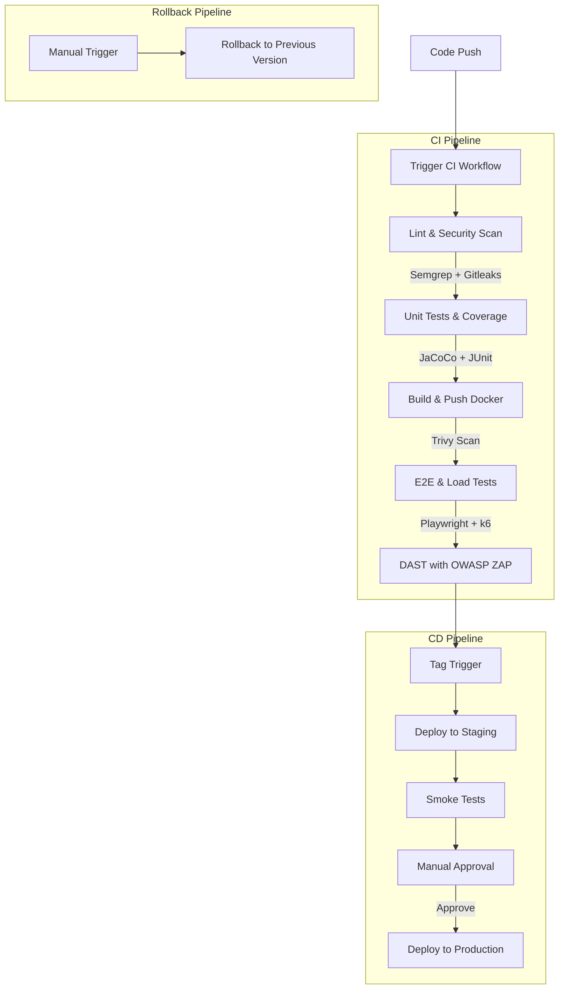

# CI/CD Pipeline Diagram

## Pipeline Stages

### CI Pipeline (ci.yml)
1. **Lint & Security Scan**: Semgrep (SAST) + Gitleaks (Secret Detection)
2. **Unit Tests**: JUnit + JaCoCo (Coverage Report)
3. **Build & Container Scan**: Build image + Trivy Vulnerability Scan
4. **E2E & Load Tests**: Playwright (API) + k6 (Performance)
5. **DAST**: OWASP ZAP Dynamic Scan

### CD Pipeline (cd.yml)
1. **Deploy to Staging**: Auto-deploy new tags
2. **Smoke Tests**: Verify basic functionality
3. **Manual Approval**: Review before production
4. **Deploy to Production**: Final rollout

### Rollback (rollback.yml)
- Manual trigger with previous version tag
- Quick rollback capability
