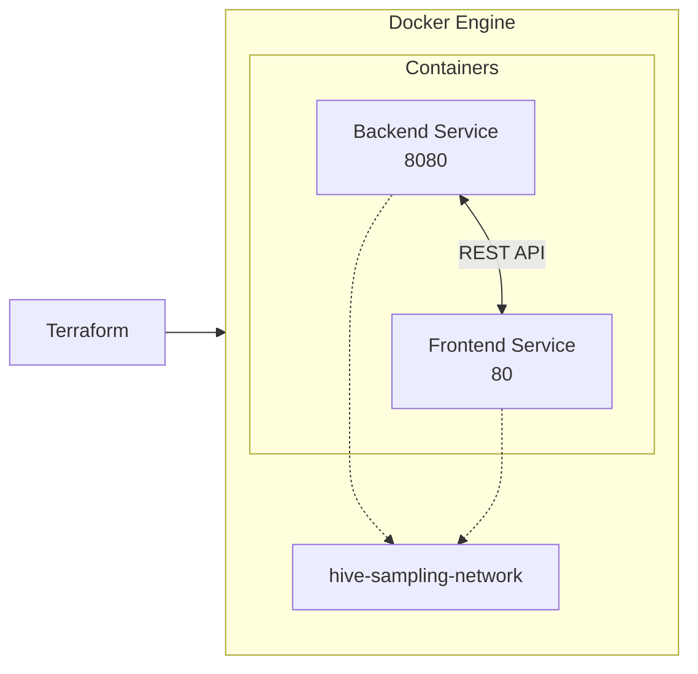

# Infrastructure as Code


```mermaid
flowchart LR
    subgraph Docker_Engine [Docker Engine]
        Network[hive-sampling-network]
        
        subgraph Containers
            Backend[Backend Service<br/>8080]
            Frontend[Frontend Service<br/>80]
        end
        
        Backend <-- REST API --> Frontend
        Backend & Frontend -.-> Network
    end
    
    Terraform --> Docker_Engine
```

## Quick Start

```bash
cd infra/terraform
terraform init
terraform plan
# terraform apply (not needed for demo)
```
